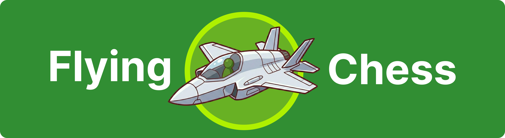

# 🚀 Flying Chess: Educational Automation Research


<p align="center">
  
</p>

**Flying Chess** is an educational research project exploring the interaction between browser extensions and dynamic web applications through DOM manipulation and artificial intelligence (AI) integration. The project is specifically designed to explore how automation logic can be implemented safely and efficiently in modern browser environments.
## 📖 How to Use
The Flying Chess menu will appear automatically when you open a supported chess[.]com game page.

## **Parameter Configuration**
- Select the mode to use : 1. Auto Suggestion or 2. Auto Pilot + Auto Comment
- Thought Depth: Sets the depth of Stockfish's AI analysis. ```min=1 max=30```
- Random Comments: A comma-separated list of text to simulate social chat interactions.
- Execution Delay: Sets the time delay (ms) between steps to simulate the rhythm of human thought.
## **Running the Simulation**
- Click the Start Flight button to activate the script. Configuration input will be automatically locked for data stability.
- The AI ​​will scan the board and provide visual recommendations in the form of red squares.
## **Stopping the Process**
- Click Stop Flight to shut down the Stockfish Web Worker and clear all manipulated elements from the page.
## 🌐 Supported Browsers
✅ Google Chrome  (Recommended for Manifest V3 API stability).
## 🛠️ Installation Guide
Installation is done via Developer Mode for experimental purposes:
```
📂 Download Repository: Download the zip file and extract it.
🔧 Open Extensions Page: Type chrome://extensions/ in your Chrome address bar.
💡 Enable Developer Mode: Slide the Developer mode toggle switch in the top right corner until it's on.
📦 Load Extension: Click the Load unpacked button and select your project folder.
✨ Done: The "Flying Chess" extension is ready to use and ready to learn!
```
## ⚠️ Important Note (Disclaimer): This repository is published solely for the purposes of learning and technical research on cybersecurity and web automation. The developers do not support or encourage the misuse of this tool for cheating in official competitions. Understanding how this system works is expected to help web developers build more robust bot defense and detection systems in the future.
## 💎 Kredit Sumber
This project uses the [Stockfish](https://stockfishchess.org/) Chess Engine (via stockfish.js) as the core of chess position data calculations. We greatly appreciate the outstanding contributions of the Stockfish open-source community in advancing global chess analysis technology.
